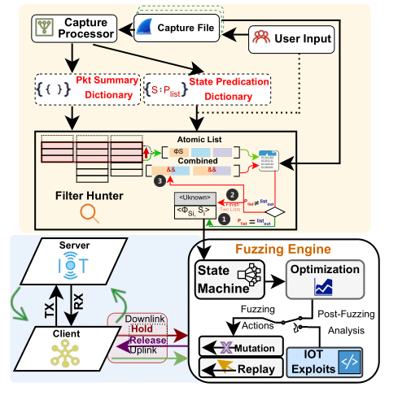

# U-Fuzz: Stateful Fuzzing of IoT Protocols on COTS Devices
U-Fuzz is a framework to systematically discover and replicate security vulnerabilities on arbitrary wired and wireless IoT protocol (e.g., CoAP, Zigbee, 5G NR) implementations. U-Fuzz offers possibility to automatically construct the protocol state machine with only a few packet traces of normal (i.e., benign) communication.

<p align="center">
  
</p>

------

**Table of Contents**

1. [📋 Software Environment](#1-software-environment)

2. [⏩ Initial Compilation](#2-⏩-initial-compilation)

3. [🔀 Running Multi-protocol Statemapper](#3-🔀-running-multi-protocol-statemapper)
    * [Manual Mode Running details](#31-manual-mode-running-details)
    * [Model representation figure](#model-representation-figure)

4. [🧑‍💻 Running the fuzzer](#4-🧑‍💻-running-the-fuzzer)
    * [Zigbee Protocol Implementation](#41-zigbee)
    * [CoAP Protocol Implementation](#42-coap)
    * [5G NR Implementation](#43-5g)
        * [Fuzzing 5G NR using Container](#431-5g-container)
        * [Fuzzing 5G NR with 5G Simulator](#432-fuzzing-5g-with-5g-simulator)
        * [Fuzzing 5G NR with real COTS](#433-fuzzing-5g-with-real-cots)
5. [📄 Exploits](#5-📄-exploits)
    * [Summary of CVEs](#51-summary-of-cves)
    * [Available Exploits](#52-available-exploits)
        * [V14 replication](#521-v14-replication)
6. [📝 Citing U-Fuzz](#6-📝-citing-u-fuzz)


------

# 1. 📋 Software Environment
* **OS:** Ubuntu 18.04 - We recommend using Ubuntu 18.04 to build and run U-Fuzz, otherwise, U-Fuzz and the Multiprotocol Statemapper might fail to execute properly. Alternativelly, you can use an Ubuntu 18.04 [docker dev. container]([url](https://code.visualstudio.com/docs/devcontainers/create-dev-container)) to ensure the correct OS environment.
* **Wireshark Version:** V4.1 (patched) - This is provided by U-Fuzz.
* **Bindings:** Python3, Golang - This is provided by U-Fuzz.

# 2. ⏩ Initial Compilation 
Several requirements need to be installed before compiling the project. An automated script for Ubuntu 18.04 is provided on `requirements.sh`. To compile from source, simply run the following commands:
```
$ Download the content from this github link:
https://anonymous.4open.science/r/cots-iot-fuzzer/

$ cd wdissector

$ ./requirements.sh dev # Install all requirements to compile wdissector from source

$./requirements.sh doc  # Optional: Install nodejs requirements to generate documentation

$./build.sh all # Compile all binaries. It may take around 15min. Go get a coffe!
```

# 3. 🔀 Running Multi-protocol Statemapper
Before running the fuzzer, the multi-protocol-Statemapper needs to be run to generate both the configuration file and the state machine model.

The multi-protocol-statemapper needs two inputs as follows: 

1: Capture_trace_for target_protocol.pcapng (can be provided via terminal). 

2: configuration template to append the mapping rules needs to specify the file name in "multi_protocol_state_mapper.py :line: 423". 

After compiling the project with the correct software environment, please run the following command with the two inputs mentioned previously.
```
$ cd .../cots-iot-fuzzer/multi_protocol_statemapper/wdissector

$ python3 multi_protocol_state_mapper.py
```

## 3.1 Manual Mode Running details

**Step 1**: Input the final capture trace as illustrated in the figure below.
<p align="center">
  
</p>

```
The user can choose to combine multiple capture file by themselves
or use U-Fuzz combiner by inputting "y" in the terminal prompt.
```

**Step 2**: After the capture analysis, all the potential state and packet list 
will be printed out. Then, the user can proceed to form a new state by entering "y". Finally, the 
potential packet list is shown (you can copy and paste from above).

<p align="center">
  
</p>

<p align="center">
  
</p>

After the initial packet list is inserted, the user can proceed by inputting 'n', or continuously add more packet lists by inputting 'y' in the question as shown in the figure below:

<p align="center">
  
</p>

**Step 3**: After the potential packet list was inserted, the capture processor will first output all the 
common layers which are shared by all packets provided by the user. Then, the capture processor will start analysing from the most 
relevant layer as shown in the figure below:

<p align="center">
  
</p>

The user may need to input a name for that state. She can alternatively copy and paste from the above figure.

<p align="center">
  
</p>

**Step 4**: One by one analysis (1 by 1) will be performed to find state filters. 

<p align="center">
  
</p>

If a state filter was not found by the previous 1 by 1 step, then 2 by 2 analysis will be performed. 

<p align="center">
  
</p>

**Step 5**: Once the filter is found, the user can decide to continuously create a new state by inputting 
'y', or to stop by inputting 'n'.

<p align="center">
  
</p>

**Step 6**: Once 'n' was provided in the previous step, other three inputs will be asked to the user for the state machine 
generation:

1. Previous input capture file;
2. Template config file;
3. The output file name, (.json is for the statemachine generation, .png is for the state machine image generation).


<p align="center">
  
</p>


## Model representation figure

<p align="center">
  
</p>


# 4. 🧑‍💻 Running the fuzzer
## 4.1 Zigbee Protocol Implementation

**Step1:**
*build the project (zigbee_real_time_fuzzer)*

```
Edit the CMakeLists.txt
$ Uncomments line:802, 810-814 
  (`set(ZIGBEE_SRC src/zigbee_real_time_fuzzer.cpp libs/shared_memory.c)`)
  (`add_executable(zigbee_real_time_fuzzer ${ZIGBEE_SRC} libs/profiling.c)`)
  (`target_link_libraries(zigbee_real_time_fuzzer PRIVATE ${MINIMAL_FUZZER_LIBS} viface)`)
  (`target_compile_options(zigbee_real_time_fuzzer PRIVATE -w -O0)`)
  (`target_compile_definitions(zigbee_real_time_fuzzer PRIVATE -DFUZZ_ZNP)`)

$ Comments line: 804, 824-828 which were configured for CoAP fuzzing
  (`set(COAP_SRC src/coap_realtime_fuzzer.cpp libs/shared_memory.c)`)
  (`add_executable(coap_realtime_fuzzer ${COAP_SRC} libs/profiling.c)`)
  (`target_link_libraries(coap_realtime_fuzzer PRIVATE ${MINIMAL_FUZZER_LIBS} viface)`)
  (`target_compile_options(coap_realtime_fuzzer PRIVATE -w -O0)`)
  (`target_compile_definitions(coap_realtime_fuzzer PRIVATE -DFUZZ_WIFI_AP)`)

$ ./build.sh all

```
**Step2:**
*Install Zigbee2Mqtt* from link: [https://www.zigbee2mqtt.io/]([url](https://www.zigbee2mqtt.io/))

The sample configuration file for Zigbee2Mqtt is located at folder 
cots-iot-fuzzer/zigbee_dongle_connection/coordinator/data

**Step3:**
*Prepare the hardware* for fuzzing Zigbee including coordinator dongle (e.g., CC2531 ZNP-Prod)
and zigbee smart devices.


**Step 4:**
*Run the fuzzer*

```
open a new terminal then run 
$ mosquitto

run the fuzzer at directory
$ cd cots-iot-fuzzer/
$ sudo bin/zigbee_real_time_fuzzer --EnableMutation=true

$ cd zigbee_dongle_connection/coordinator
$ docker-compose up
```

## 4.2 CoAP Protocol Implementation

**Step1:**
*build the project (coap_realtime_fuzzer)*
```
$ ./build.sh all

```
**Step2:**
Set up target CoAP sever implementation (e.g., Libcoap)

**Step3:**
*Run the Fuzzer*
```
$ Run CoAP Server

$ cd cots-iot-fuzzer/
$ sudo bin/coap_realtime_fuzzer --EnableMutation=true
$ cd cots-iot-fuzzer/coap_client_server
$ sudo ip netns exec veth5 node client_complete.js
```
## 4.3 5G NR Implementation (Standalone)

### 4.3.1 Fuzzing 5G NR using Container:
Download the 5G container from the docker hub.

Credential: 

```
docker login -u a80568681433

Access token:
dckr_pat_A7VRSeNGp_tJPhIAuk4Iksk0pxM
```

### 4.3.2 Fuzzing 5G NR with 5G Simulator:

$ cd */wireless-deep-fuzzer/5gcontainer

$ chmod +x container.sh

$ ./container.sh run release-5g

Use the following command to just run 5G simulator
$ sudo bin/lte_fuzzer --EnableSimulator=true


### 4.3.3 Fuzzing 5G NR with real COTS: 
Hardware Preparation:

  [OnePlus Nord CE2](https://www.oneplus.com/sg/nord-ce-2-5g/specs) or other 5G COTS UE.

  [USRP B210](https://www.ettus.com/all-products/usrp-b200-enclosure/)

Command:

```
$ chmod +x container.sh

$ ./container.sh run release-5g

$ sudo bin/lte_fuzzer  --EnableSimulator=false

```

# 5. 📄 Exploits
## 5.1.  Summary of CVEs:
As of today, U-Fuzz has discovered 11 new security flaws which have been assigned 11 CVE IDs. The correspondence between the exploit name, U-Fuzz discovered vulnerability and the CVE IDs are shown in the Tables below:

| Protocol Under Test | U-Fuzz Vulnerability Name | Affected Hardware/<br>Software Implementation                | CVE            |
| --------------------|---------------------------|-------------------------------------------|----------------|
| 5G                  | V1 - Invalid CellGroupConfig | OnePlus Nord CE 2 | CVE-2024-20004           |
| 5G                  | V2 - Invalid CellGroupId     | OnePlus Nord CE 2 | CVE-2024-20003           |
| 5G                  | V3 - Invalid RLC Sequence    | OnePlus Nord CE 2 | CVE-2023-20702 (existed) |
| 5G                  | V4 - Invalid Uplink Config Element| OnePlus Nord CE 2| CVE-2023-32843 (existed) |
| 5G                  | V5 - Null Uplink Config Element | OnePlus Nord CE 2| CVE-2023-32845 (existed) |
| Zigbee              | V6 - Invalid Transaction<br>and Cluster ID | Texas Instrument CC2531 USB Dongle Z-stack version:<br>Z-Stack_Home_1.2<br> SONOFF Zigbee 3.0 USB<br> Dongle-P Z-stack version:<br> Z-Stack_3.0.x | CVE-2023-41388 |
| Zigbee              | V7 - Invalid Transaction<br>and Cluster ID| Zigbee2Mqtt Version:3.8| CVE-2023-41003           |
| Zigbee              | V8 - Malformed AF_Data_Request| Zigbee2Mqtt Version:3.8 | CVE-2023-42386           |
| Zigbee              | V9 - Out of Sync State Information| Zigbee2Mqtt Version:3.8 |CVE-2023-41004           |
| Zigbee              | A1 - Skip Link Status| Tuya Smart Plug| Not applicable |
| Zigbee              | A2 - Skip Link Status| Philips Hue Smart Light Bulb| Not applicable           |
| CoAP                | V10 - NullPointerException| Jcoap | CVE-2023-34918           |
| CoAP                | V11 - Illegal_Argument_Exception<br>_Invalid_Token_Length | Jcoap | CVE-2023-34920           |
| CoAP                | V12 - Slice_Bounds_out_of_Range| Canopus | CVE-2023-34919           |
| CoAP                | V13 - Bad Get Request| Canopus | CVE-2023-34921           |
| CoAP                | V14 - Invalid Size1 Size2 Options| libcoap| CVE-2023-33605           |
| CoAP                | V15 - Bad POST Request| CoAPthon| CVE-2018-12680 (existed) |
| CoAP                | V16 - Invalid Unicode Decoding| CoAPthon | CVE-2018-12680 (existed) |

## 5.2. Available Exploits
| U-Fuzz Vulnerability Name                             | Exploit                |
| ----------------------------------------------------- | ---------------------- |
| V1 - Invalid CellGroupConfig                          | [mac_sch_mtk_rrc_setup_crash_2](/modules/exploits/5gnr_gnb/mac_sch_mtk_rrc_setup_crash_2.cpp)|
| V2 - Invalid CellGroupId                              | [mac_sch_mtk_rrc_setup_crash_1](/modules/exploits/5gnr_gnb/mac_sch_mtk_rrc_setup_crash_1.cpp)|
| V3 - Invalid RLC Sequence                             | [mac_sch_mtk_rlc_crash](/modules/exploits/5gnr_gnb/mac_sch_mtk_rlc_crash.cpp)|
| V4 - Invalid Uplink Config Element                    | [mac_sch_mtk_rrc_setup_crash_3](/modules/exploits/5gnr_gnb/mac_sch_mtk_rrc_setup_crash_3.cpp)|
| V5 - Null Uplink Config Element                       | [mac_sch_mtk_rrc_setup_crash_4](/modules/exploits/5gnr_gnb/mac_sch_mtk_rrc_setup_crash_4.cpp)|
| V10 - NullPointerException                            | [replicate_crash_jcoap_1](/CoAP_Crash/replicate_crash_jcoap_1.py)|
| V11 - Illegal_Argument_Exception_Invalid_Token_Length | Can replace replicate_crash_jcoap_1 to any PUT request | 
| V12 - Slice_Bounds_out_of_Range                       | [replicate_crash_canpous](/CoAP_Crash/replicate_crash_canpous.py)|
| V13 - Bad Get Request                                 | [replicate_crash_canpous](/CoAP_Crash/replicate_crash_canpous.py)|
| V15 - Bad POST Request                                | [replicate_crash_CoAPthon](/CoAP_Crash/replicate_crash_CoAPthon.py)|
| V16 - Invalid Unicode Decoding                        | [replicate_crash_CoAPthon](/CoAP_Crash/replicate_crash_CoAPthon.py)|

### 5.2.1 V14 replication
Our group used Esp32 board to fuzz libcoap and to replicate the vulnerability V14 that we found on libcoap. The detailed replication tutorial 
can be found at [Libcoap_crash_replication_tutorial](/CoAP_Crash/Libcoap_crash_replication_tutorial.pdf). Additionally, the replication 
script can be found at [replicate_crash_libcoap](/CoAP_Crash/replicate_crash_libcoap.py).

# 6. 📝 Citing U-Fuzz

```
@inproceedings{
  author={Shang, Zewen and Garbelini, Matheus E and Chattopadhyay, Sudipta},
  booktitle={2024 IEEE Conference on Software Testing, Verification and Validation (ICST)}, 
  title={U-Fuzz: Stateful Fuzzing of IoT Protocols on COTS Devices}, 
  year={2024},
}
```
